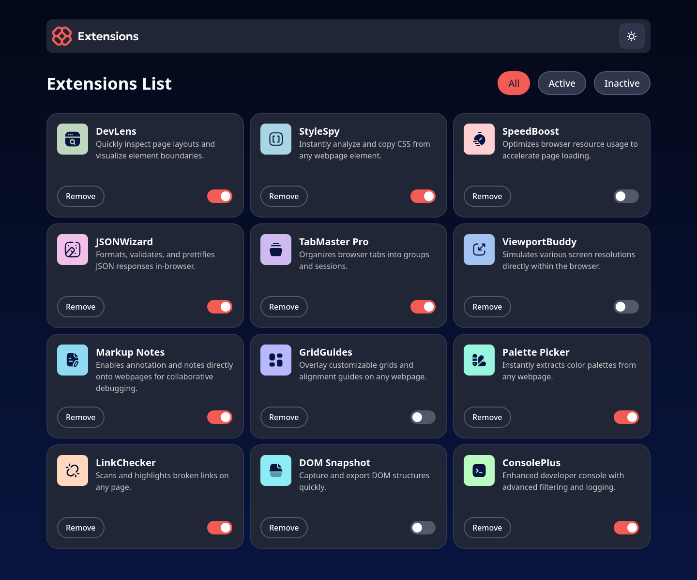

# Frontend Mentor - Browser Extensions Manager UI Solution

This is a solution to the [Browser extensions manager UI challenge on Frontend Mentor](https://www.frontendmentor.io/challenges/browser-extension-manager-ui-yNZnOfsMAp).

## Table of contents

-   [Overview](#overview)
    -   [The challenge](#the-challenge)
    -   [Screenshot](#screenshot)
    -   [Links](#links)
-   [My process](#my-process)
    -   [Built with](#built-with)
    -   [What I learned](#what-i-learned)
    -   [Continued development](#continued-development)
    -   [Useful resources](#useful-resources)

## Overview

### The challenge

Users should be able to:

-   Toggle extensions between active and inactive states
-   Filter active and inactive extensions
-   Remove extensions from the list
-   Select their color theme
-   View the optimal layout for the interface depending on their device's screen size
-   See hover and focus states for all interactive elements on the page

### Screenshot

### Links

-   Solution URL: [Add solution URL here](https://your-solution-url.com)
-   Live Site URL: [Add live site URL here](https://your-live-site-url.com)

## My process

### Built with

-   ♥
-   Semantic HTML5 Markup
-   Custom CSS Properties
-   CSS Grid & Flexbox
-   ReactJS
-   Mobile-first Workflow

### What I learned

Where do I begin? A lot. Especially when I started this project with the intention to make it fully accessible to screen readers.

I learned about making accessible toggles using the `button` element and the `aria-pressed` attribute instead of the go-to checkbox approach. I learned how to utilize the power of `aria-label` correctly to make buttons more accessible to screen readers, something I never really knew how to do right. Also, when and where `aria-hidden` should be used to avoid unnecessary descriptions of content that didn't require the user's attention.

Another thing I learned was coding a light/dark mode. I've actually tackled this once before in a personal project: [Virtual Keyboard](https://github.com/VendettaJoy/virtual-keyboard/tree/main), but since for the current project I had made the decision to use ReactJS, there were several approaches to implementing a light/dark mode. After reading up on a lot of articles and watching tutorials using either Stylized Components (I do not like having CSS in my JS), or Tailwind CSS (I do not like how clogged the HTML tags get), I preferred the approach with React's Context API (`useContext`).

Styling the app was the most challenging part of this project. In my honest opinion, I thought there were too many colours for such a simple app, but I managed to get it to look as close to the provided design screenshots with a few exceptions. I wish better quality images were provided, but I managed. I'm sure some things could still be improved, but I'm done with this project for now!

### Continued development

Now equipped with more new knowledge, I hope to complete future projects in better time and with better accessibility features :)

### Useful resources
1. [Checkboxes in React](https://codesandbox.io/p/sandbox/react-todo-list-add-delete-checkbox-bthfs?file=%2Fsrc%2Fcomponents%2FApp%2FApp.js): Before I used `button` for my toggles, I initially used checkboxes, and since it was a controlled input I referred to this CodeSandbox project, which even though I didn't end up using for this project will surely be useful in the future
2. [Inclusive Components - Toggle Buttons](https://inclusive-components.design/toggle-button/): I luckily found this through another blogpost who's topic was styling accessible toggles, and I would've been lost without this 
3. [MDN entry for aria-pressed Toggle](https://developer.mozilla.org/en-US/docs/Web/Accessibility/ARIA/Reference/Roles/button_role#toggle_buttons): I referred to the examples listed here 
4. [Toggle Styling](https://www.newscientist.com/): Not really a coding resource, but I made a breakthrough when I studied the website's light/dark toggle using FireFox's DevTools. I found that instead of using `translateX` to move the toggle handle, I could use the `right` CSS property to change the handle's position. While `translateX` was getting the job done, some toggles' handles weren't centered within the toggle's body correctly, which was apparently a result of using `translateX`
5. [Dark Mode in React](https://www.youtube.com/watch?v=sy-rRtT84CQ): YT tutorial I used for the light/dark mode in React; I went one step further and chose to use Context
6. [Colour Theme Transition](https://mwichary.medium.com/dark-theme-in-a-day-3518dde2955a): Found this really handy snippet of code that helped smoothen the transition between light and dark mode
7. [Prefers Reduced Motion](https://developer.mozilla.org/en-US/docs/Web/CSS/@media/prefers-reduced-motion): I did also add in a snippet of code using media queries to remove any and every animation if the user prefers reduced motion
8. [Orca Screen Reader](https://help.gnome.org/users/orca/stable/): I'm a Linux user so the NVDA screen reader isn't available to me, but luckily the Orca Screen Reader comes built-in (in GNOME specifically) and this was the first time I had a reason to use it. Using this, I tested the accessibility of my app and made any necessary changes to the ARIA labels 
9. [Axe DevTools](https://addons.mozilla.org/en-US/firefox/addon/axe-devtools/?utm_source=addons.mozilla.org&utm_medium=referral&utm_content=search): Another super useful tool, a web accessibility testing extension for FireFox. It generates a report after running a scan of the page to check whether your code adheres to the current WCAG guidelines
10. [Using multiple CSS Classes with CSS Modules](https://www.codeconcisely.com/posts/react-css-modules-multiple-classes/): I wasn't sure how to use multiple classes when using CSS modules and this blogpost was useful
11. [Concept Testing](https://codesandbox.io/): CodeSandbox came in handy when I wanted to run small tests and/or debug certain features first before I added them to my app
